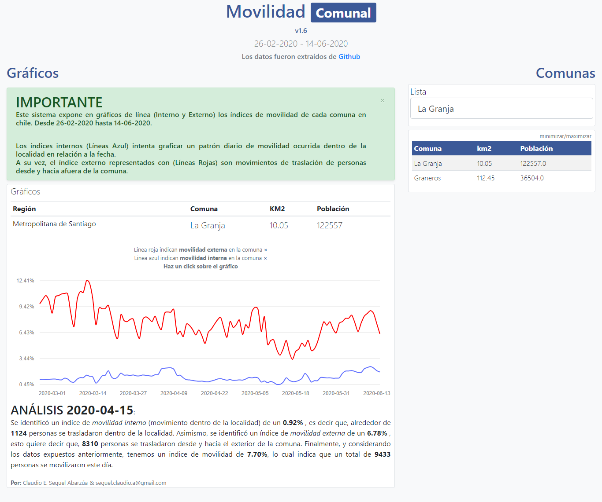

# Sistema de Interoperabilidad Vecinal 🌐

# Movilidad-Comunal
Movilidad comunal
# Description

Este sistema, fue desarrolado en el 2020, en respuesta a la creciente pandemia mundial a la que fuimos expuesto, este sistema, tomaba los datos expuesto por el gobieron de Chile, para la comunidad (Cientifica-Informatica), con el fin de desarrollar sistemas de analis de datos, y fue asi como se termino por crear esta aplicacion de analisis, que buscaba graficar el comportamiento (movilidad) de las personas de acuerdo a los datos proporionados.

